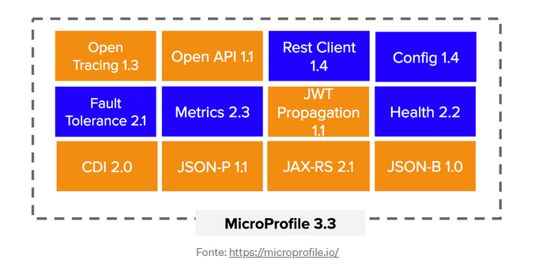
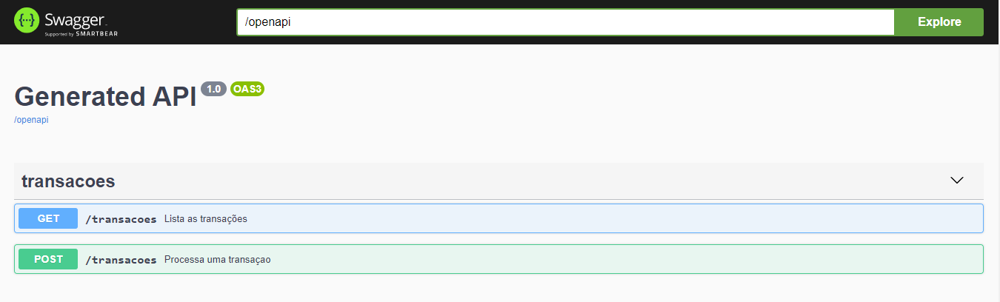
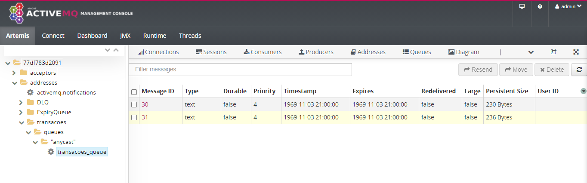
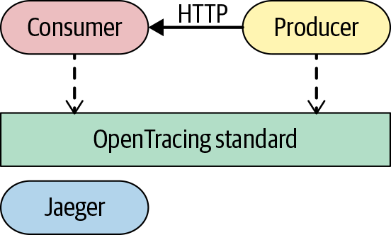
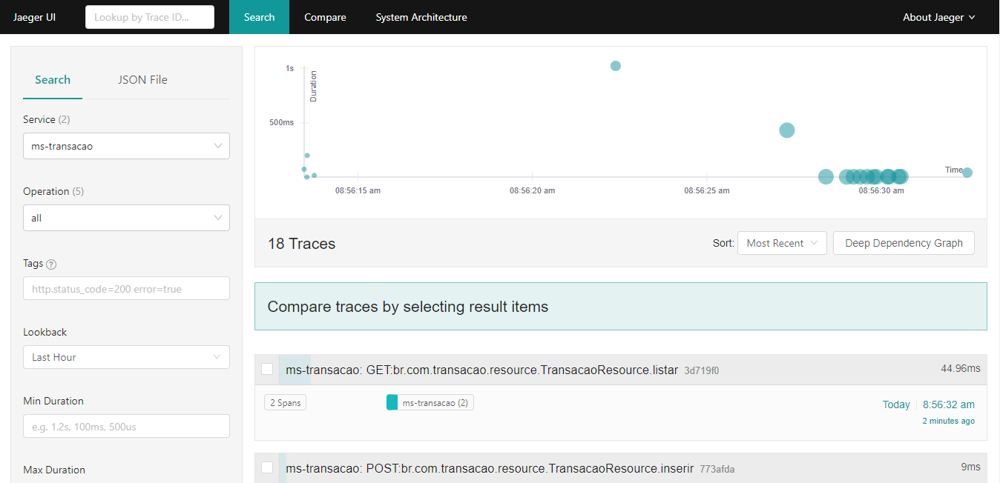
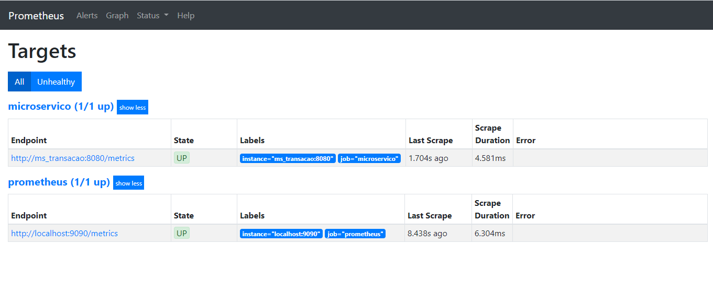
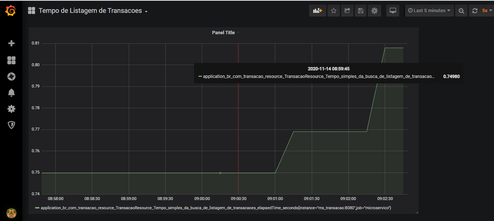

# API Exemplo Quarkus

Este código tem como por objetivo apresentar as funcionalidades básicas do quarkus referente a implementação do 
Microprofile e aderência a cloud native applications.

### Ferramentas Utilizadas

- Java SE Development Kit (Versão 11)
- Eclipse IDE
- Maven
- Docker
- Docker Compose

## Construído Com:

- [Quarkus](https://quarkus.io/)
- [Maven](https://maven.apache.org/)

### Referência

- Este projeto segue as recomendações [**CloudNative**](https://www.cncf.io/) e [**twelve-factor app**](https://12factor.net/) . 

### Desafios na arquitetura de microserviços

- Gerência de configuração
- Dinamismo e escalabilidade
- Aplicação distribuída
- Tracing e monitoramento
- Fault Tolerance (resiliência)

### Por que Quarkus?

No meu ponto de vista o quarkus possui 3 pontos que vale a pena destacar:

1. O tempo de startup, no mundo de microserviços os containers são efêmeros e devem ser capaz de se recuperar e escalar rapidamente.
2. O uso de memória e processamento. Atualmente para o mundo cloud o uso de memória e processamento tem um custo essêncial seguindo a idéia de Pay per Use.
3. O fato de implementar o Microprofile onde trás um conjunto de especificações focadas e microserviços.




### Tecnologias utilizadas

| Artefato                        |Porta  | Descrição  |
|---------------------------------|------ |-----|
| ms_transacao                    | 8080  | Microserviço responsável por receber uma transação e realizar sua persistência |
| postgres-database               | 5432  | Banco de dados postgres responsável pelo armazenamento dos dados  |
| Artemis MQ                      | 8161  | Servidor de mensageria que utilizamos neste exemplo |
| jaeger_service                  | 14268 | Serviço responsável por monitorar e rastrear o trace de chamada dos microserviços  |
| grafana-service                 | 3000  | Instância do Prometheus, responsável por obter as métricas dos microserviços e apresentar o monitoramento |
| prometheus-service              | 9090  | Responsável por obter as métricas de monitoramento dos microserviçoes e enviar para o Grafana  |

### Swagger OpenApi e Documentação

Neste exemplo basicamente a proposta da API é processar uma transação de pagamento e listar as transações processadas.



### Mensageria e escalabilidade



### Jaeger e Logs

O Log e Tracing é o 11. fator referente ao cloud native. Os logs são tratados como uma sequência e eventos emitidos pelos microserviços de forma ordernada de 
acordo com o tempo. Um dos principais desafios da arquitetura de microserviços é o armazenamento, análise e rastrabilidade de logs uma vez que as regras
de negócios estão distribuídas em sua arquitetura. Uma das alternativas é a utilização do Jaeger, que será responsável pelo armazenamento de todos os logs
da aplicação. A sua configuração se dá através do application.properties




```sh
	#configuracao do jaeger
	quarkus.jaeger.service-name=ms-transacao
	quarkus.jaeger.sampler-type=const
	quarkus.jaeger.sampler-param=1
	quarkus.jaeger.endpoint=http://jaeger_service:14268/api/traces
```

Desta forma os logs serão enviados via chamada http para o container do Jaeger e poderá ser visualizado na tela abaixo:



### Prometheus e Observabilidade

Um outro grande desafio no mundo dos microserviços é a observabilidade, como se trata de um ambiente distribuído e independente torna-se extremamente importante
o monitoramento dessas features de forma proativa, sendo assim reduzindo qualquer risco e otimizando o tempo de resposta em caso de incidentes/crise.

O prometheus diferentemente do Logstash(referente ao Stack do ELK) tem uma abordagem de "buscar" as métricas a partir da sua configuração, o mesmo será responsável por de tempos
em tempos checar as métricas dos seus microserviços, isso acontece através do healh check ou metrics. Ambos são importantes para a checagem de disponibilidade e 
comportamento da nossa solução.

A configuração de jobs de checagem ou scrap no prometheus é realizada através de um arquivo declarativo (prometheus.yml), da seguinte forma:

```sh
- job_name: 'microservico'

    # metrics_path defaults to '/metrics'
    # scheme defaults to 'http'.
    scrape_interval:     5s # Set the scrape interval to every 15 seconds. Default is every 1 minute.
    static_configs:
    - targets: ['ms_transacao:8080']
```

O arquivo descrito acima é passado via parmâmetro no momento de criação do container no docker compose.



### Grafana e Monitoramento

Até o tópico anterior, focamos na forma de como obter a métrica de um microserviço. No quarkus, esta métrica é facilmente obtida pelo fato do framework 
implementar várias features do microprofile. o /metrics é uma delas.

Neste passo referente ao grafana, o nosso maior requisito é ter a possibilidade de ler as métricas forma amigável. O Grafana tem a proposta de acessar
o prometheus via datasource e apresentar este dado em tempo real de forma gráfica conforme abaixo:



### Executando a aplicação em container

```sh
docker-compose up
```

